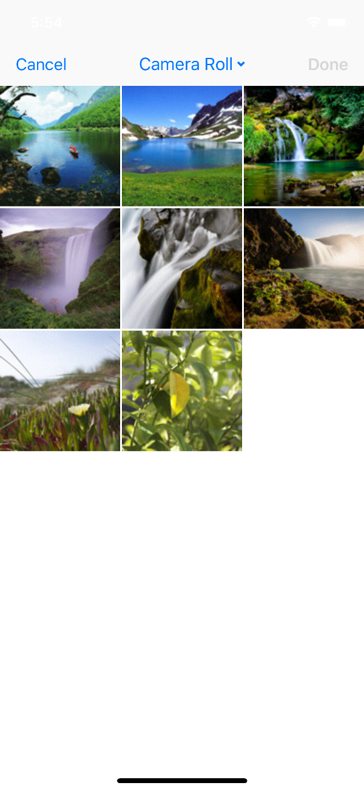
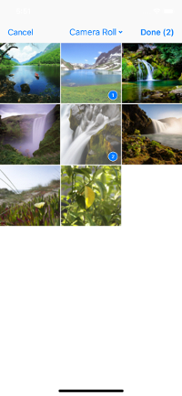
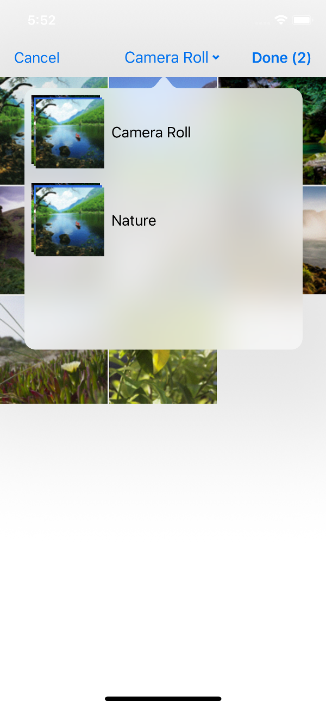
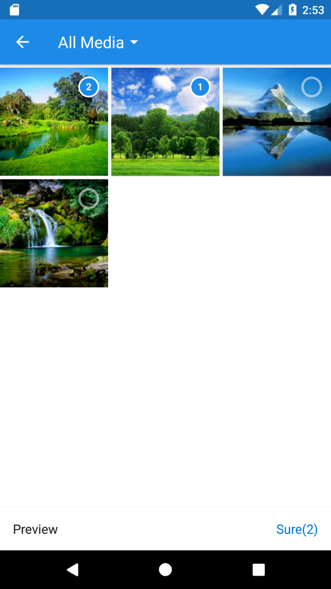
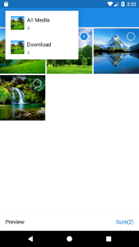

# multi_image_picker

> Flutter plugin that allows you to display multi image picker on iOS and Android.

## iOS

  

For the iOS picker the plugin uses [BSImagePicker](https://github.com/mikaoj/BSImagePicker)

## Android

  

For the Android picker the plugin uses [Matisse](https://github.com/zhihu/Matisse)

## Usage

First you need to [add](https://pub.dartlang.org/packages/multi_image_picker#-installing-tab-) the plugin to your project.

### iOS

You need to add those strings to your Info.plist file in order the plugin to work:
```xml
<key>NSPhotoLibraryUsageDescription</key>
<string>Example usage description</string>
<key>NSCameraUsageDescription</key>
<string>Example usage description</string>
```

### Android

You need to request those permissions in AndroidManifest.xml in order the plugin to work:

```xml
<uses-permission android:name="android.permission.WRITE_EXTERNAL_STORAGE" />
<uses-permission android:name="android.permission.READ_EXTERNAL_STORAGE" />

```

For example code usage, please see [here](https://github.com/Sh1d0w/multi_image_picker/blob/master/example/lib/main.dart)

## API

### pickImages(maxImages: int)

#### maxImages

Type: `int`

Maximum allowed images to be selected.

## TODO

- [ ] Add support for more plugin specific options for iOS and Android, that allows more customization
- [ ] Allow choosing videos

## Related

- [image_picker](https://pub.dartlang.org/packages/image_picker) - Official Flutter image picker plugin

## License

MIT © [Radoslav Vitanov](https://github.com/Sh1d0w)